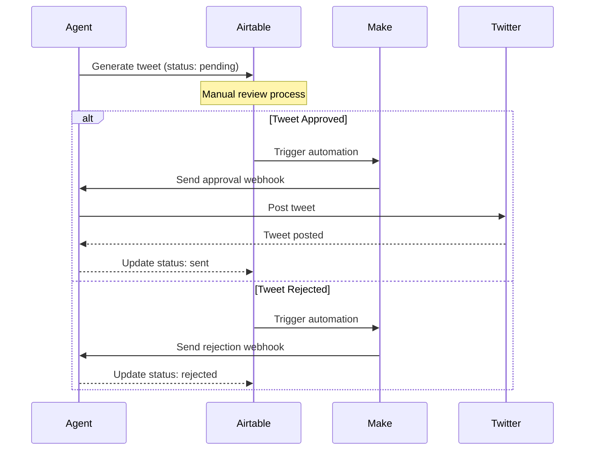

# Eliza

## Quick Setup Guide

1. **Create Make (Integromat) Webhook**:
   - Go to Make.com (formerly Integromat)
   - Create new scenario with two routes:
     
     **Route 1: Handle New Tweets**
     - Add "Webhooks" module > "Custom webhook"
     - Copy the webhook URL (looks like `https://hook.eu1.make.com/abc123...`)
     - This URL will be your `MAKE_WEBHOOK_URL`
     - Add "Airtable > Create Record"
     - Connect to your "Tweet Approvals" table
     - Map fields from webhook payload

     **Route 2: Check Approvals**
     - Add "Airtable > Search Records"
     - Filter: status changed from "pending"
     - Add "Airtable > Update Record"
     - Set status to "processing"
     - Return approval data to agent

2. **Set Up Airtable**:
   - Create new base
   - Create "Tweet Approvals" table with these fields:
     ```
     approval_id (Single line text)
     status (Single select: pending/approved/rejected/processing/sent)
     content (Long text)
     modified_content (Long text) - Optional
     reason (Long text) - Optional
     agent_name (Single line text)
     agent_username (Single line text)
     ```

3. **Configure Your Agent**:
   ```bash
   # 1. Set up .env
   cp .env.example .env
   
   # 2. Add to .env:
   MAKE_WEBHOOK_URL="your_make_webhook_url"  # The URL from step 1
   TWITTER_USERNAME="your_username"
   TWITTER_PASSWORD="your_password"
   TWITTER_EMAIL="your_email"
   
   # 3. Create character file (characters/your-character.json):
   {
     "name": "Your Character",
     "clients": ["twitter"]
   }
   
   # 4. Run the agent:
   pnpm auto --character=characters/your-character.json
   ```

## Complete Flow

1. **Agent Generates Tweet**:
   ```
   Agent → Creates tweet → Sends to Make webhook → Make creates Airtable record (status: pending)
   ```

2. **Approval Process**:
   ```
   You review in Airtable → Change status to approved/rejected
   ```

3. **Agent Polls for Approvals**:
   ```
   Every 30 seconds:
   Agent → Asks Make for approvals → Make checks Airtable → Returns approved/rejected tweets
   ```

4. **Agent Processes Approvals**:
   ```
   If approved: Agent → Posts to Twitter → Updates status in Airtable to "sent"
   If rejected: Agent → Logs rejection → Updates status in Airtable to "rejected"
   ```

The agent runs as a background worker, periodically checking for approvals through Make's webhook.

## Edit the character files

Open `agent/src/character.ts` to modify the default character. Uncomment and edit.

### Custom characters

To load custom characters instead:
- Use `pnpm auto --character="path/to/your/character.json"`
- Multiple character files can be loaded simultaneously

### Add clients

```diff
- clients: [],
+ clients: ["twitter"],
```

## Duplicate the .env.example template

```bash
cp .env.example .env
```

\* Fill out the .env file with your own values.

### Add login credentials and keys to .env

```diff
-TWITTER_USERNAME= # Account username
-TWITTER_PASSWORD= # Account password
-TWITTER_EMAIL= # Account email
+TWITTER_USERNAME="username"
+TWITTER_PASSWORD="password"
+TWITTER_EMAIL="your@email.com"

# Twitter Webhook Configuration
WEBHOOK_URL_APPROVAL="your_airtable_webhook_url"  # URL for approval webhook
```

## Twitter Approval Flow

The Twitter agent includes an approval system that requires manual review of tweets before they are posted. Here's how it works:

### Visual Flow Diagram


### Setup Process

1. **Airtable Setup**:
   - Create a new base in Airtable
   - Create a table called "Tweet Approvals" with these fields:
     ```
     approval_id (Single line text) - Unique ID for each tweet
     content_type (Single select) - Options: post, reply, mention, dm
     content (Long text) - The tweet content
     status (Single select) - Options: pending, approved, rejected
     modified_content (Long text) - Optional field for edited content
     reason (Long text) - Optional field for approval/rejection reason
     timestamp (Date time) - When the tweet was queued
     context (Long text) - JSON field with thread info, reply context, etc.
     agent_name (Single line text) - Name of the agent that generated the tweet
     ```

2. **Make (Integromat) Setup**:
   - Create a new scenario
   - Add Airtable trigger:
     - Watch Records in Tweet Approvals table
     - Filter: When status changes from "pending"
   - Add webhook action with this payload:
     ```json
     {
       "type": "approval_response",
       "data": {
         "approval_id": "{{approval_id}}",
         "approved": "{{status}} = 'approved'",
         "modified_content": "{{modified_content}}",
         "reason": "{{reason}}"
       }
     }
     ```

### Running the Agent

1. **Configure Character**:
   Create or edit your character file (e.g., `characters/your-character.json`):
   ```json
   {
     "name": "Your Character",
     "clients": ["twitter"],
     "settings": {
       "webhook": {
         "url": "your_make_webhook_url",
         "logToConsole": true
       }
     }
   }
   ```

2. **Start the Agent**:
   ```bash
   pnpm auto --character=characters/your-character.json
   ```

### Approval Flow Process

1. **Tweet Generation**:
   - Agent generates a tweet/reply
   - Tweet is assigned a unique `approval_id`
   - Tweet is sent to Airtable with status "pending"

2. **Review Process in Airtable**:
   - New tweets appear with "pending" status
   - Review options:
     - Approve: Change status to "approved"
     - Reject: Change status to "rejected" and add reason (optional)
     - Modify: Edit content in modified_content field before approving

3. **Post-Review**:
   - Status change triggers Make automation
   - Make sends webhook to agent
   - If approved: Agent posts to Twitter
   - If rejected: Tweet is marked as rejected

### Environment Variables

Required variables in your `.env`:
```env
# Twitter Authentication
TWITTER_USERNAME=your_twitter_username
TWITTER_PASSWORD=your_twitter_password
TWITTER_EMAIL=your_twitter_email

# Webhook Configuration
WEBHOOK_URL_APPROVAL=your_make_webhook_url

# Optional Configuration
TWITTER_DRY_RUN=false  # Set to true to skip actual Twitter posting
```

### Monitoring and Debugging

1. **View Agent Logs**:
   - Agent logs show webhook processing
   - Tweet status updates
   - Twitter API interactions

2. **Check Airtable**:
   - Monitor pending tweets
   - Track approval status
   - View tweet history

3. **Debug Mode**:
   Enable detailed logging in character settings:
   ```json
   {
     "settings": {
       "webhook": {
         "logToConsole": true
       }
     }
   }
   ```

### Troubleshooting

1. **Common Issues**:
   - "No webhook URL configured": Check WEBHOOK_URL_APPROVAL in .env
   - "Twitter authentication failed": Verify Twitter credentials
   - "Invalid approval payload": Check Make automation configuration

2. **Tweet Status Meanings**:
   - pending_approval: Awaiting review
   - sent: Posted to Twitter
   - rejected: Rejected in review
   - error: Failed to post

## Install dependencies and start your agent

```bash
pnpm i && pnpm auto --character=characters/your-character.json
```

## Contributing

Feel free to submit issues and enhancement requests!

## Detailed Make and Airtable Setup Guide

### Airtable Configuration

1. **Create New Base**:
   - Create a new Airtable base
   - Name it something like "Twitter Agent Approvals"

2. **Create Content Approvals Table**:
   Create a table with these fields:
   ```
   - approval_id (Single line text) - Primary field
   - content_type (Single select)
     Options: post, reply, mention, dm
   - content (Long text)
   - status (Single select)
     Options: pending, approved, rejected
   - modified_content (Long text)
   - reason (Long text)
   - agent_name (Single line text)
   - agent_username (Single line text)
   - timestamp (DateTime)
   - context (Long text/JSON)
   ```

3. **Create Views**:
   - "Pending Approvals" (Filter: status = pending)
   - "Approved Content" (Filter: status = approved)
   - "Rejected Content" (Filter: status = rejected)

### Make (Integromat) Configuration

You need to create two scenarios in Make:

#### Scenario 1: Handle Approval Requests

1. **Webhook Trigger**:
   - Add "Webhooks" module
   - Select "Custom webhook" 
   - Create webhook
   - Save the webhook URL (This will be your MAKE_WEBHOOK_URL)
   - Add filter:
     1. Click "Add filter" button
     2. Set "Condition" to: data.type
     3. Set "Operator" to: Equal to
     4. Set "Value" to: approval_request

2. **Router**:
   - Add a router to handle different content types

3. **Airtable Create Record**:
   - Connection: Your Airtable account
   - Base: Your approval base
   - Table: Content Approvals
   - Map these fields:
     ```
     approval_id: {{webhook.data.data.approval_id}}
     content_type: {{webhook.data.data.content_type}}
     content: {{webhook.data.data.content}}
     status: "pending"
     agent_name: {{webhook.data.data.agent.name}}
     agent_username: {{webhook.data.data.agent.username}}
     timestamp: {{webhook.data.timestamp}}
     context: {{webhook.data.data.context}}
     ```

#### Scenario 2: Handle Approval Checks

1. **Webhook Trigger**:
   - Add another "Webhooks" module
   - Select "Custom webhook"
   - Create webhook (use same URL as Scenario 1)
   - Add filter:
     ```
     data.type = "check_approvals"
     ```

2. **Airtable Search**:
   - Module: Search Records
   - Table: Content Approvals
   - Filter formula:
     ```
     AND(
       {agent_name} = webhook.data.data.agent.name,
       {agent_username} = webhook.data.data.agent.username,
       NOT({status} = 'pending')
     )
     ```
   - Sort: Created time DESC

3. **Array Aggregator**:
   - Collect all found records

4. **Webhook Response**:
   - Set response body:
     ```json
     [
       {
         "approval_id": "{{item.approval_id}}",
         "approved": "{{item.status}} = 'approved'",
         "modified_content": "{{item.modified_content}}",
         "reason": "{{item.reason}}"
       }
     ]
     ```

### Testing the Setup

1. **Test Approval Request**:
   ```bash
   curl -X POST https://your-make-webhook-url \
     -H "Content-Type: application/json" \
     -d '{
       "type": "approval_request",
       "data": {
         "approval_id": "test-123",
         "content_type": "post",
         "content": "Test tweet",
         "agent": {
           "name": "TestAgent",
           "username": "test_user"
         }
       }
     }'
   ```

2. **Test Approval Check**:
   ```bash
   curl -X POST https://your-make-webhook-url \
     -H "Content-Type: application/json" \
     -d '{
       "type": "check_approvals",
       "data": {
         "agent": {
           "name": "TestAgent",
           "username": "test_user"
         }
       }
     }'
   ```

### Troubleshooting

1. **Webhook Issues**:
   - Check Make scenario history
   - Verify webhook URL in .env matches Make
   - Check for valid JSON in requests

2. **Airtable Issues**:
   - Verify field names match exactly
   - Check API permissions
   - Ensure proper data types in fields

3. **Common Problems**:
   - Webhook timeouts: Increase timeout in Make
   - Missing data: Check JSON mapping
   - Status not updating: Check Airtable permissions
