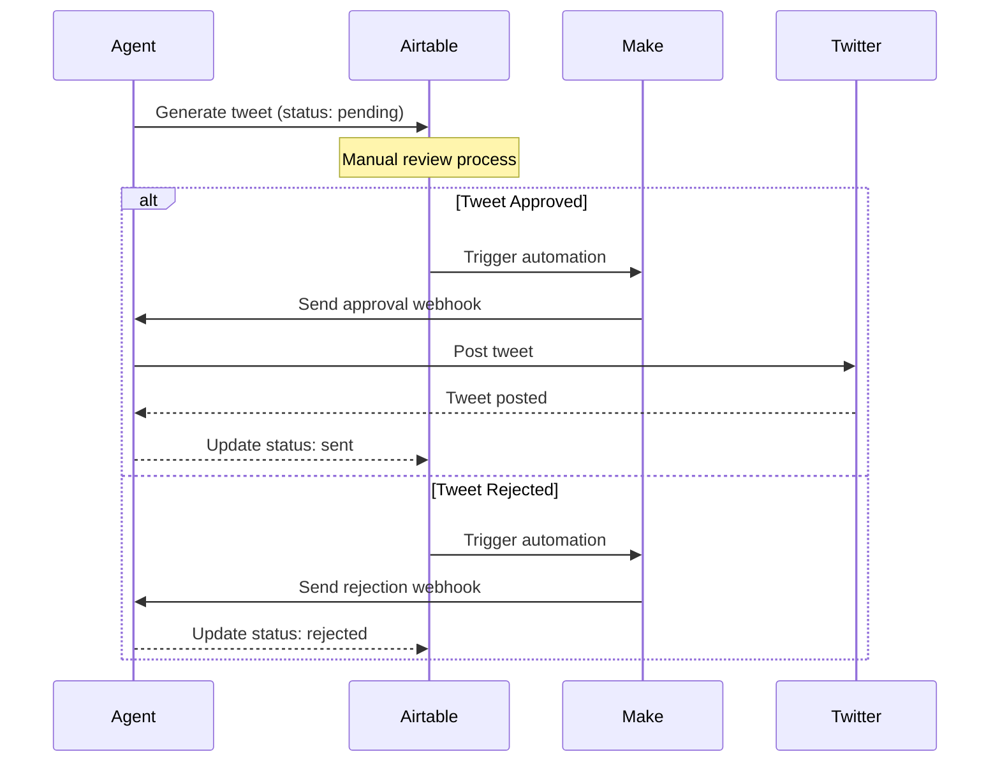

# Eliza

## Edit the character files

Open `agent/src/character.ts` to modify the default character. Uncomment and edit.

### Custom characters

To load custom characters instead:
- Use `pnpm auto --character="path/to/your/character.json"`
- Multiple character files can be loaded simultaneously

### Add clients

```diff
- clients: [],
+ clients: ["twitter"],
```

## Duplicate the .env.example template

```bash
cp .env.example .env
```

\* Fill out the .env file with your own values.

### Add login credentials and keys to .env

```diff
-TWITTER_USERNAME= # Account username
-TWITTER_PASSWORD= # Account password
-TWITTER_EMAIL= # Account email
+TWITTER_USERNAME="username"
+TWITTER_PASSWORD="password"
+TWITTER_EMAIL="your@email.com"

# Twitter Webhook Configuration
WEBHOOK_URL_APPROVAL="your_airtable_webhook_url"  # URL for approval webhook
```

## Twitter Approval Flow

The Twitter agent includes an approval system that requires manual review of tweets before they are posted. Here's how it works:

### Visual Flow Diagram


### Setup Process

1. **Airtable Setup**:
   - Create a new base in Airtable
   - Create a table called "Tweet Approvals" with these fields:
     ```
     approval_id (Single line text) - Unique ID for each tweet
     content_type (Single select) - Options: post, reply, mention, dm
     content (Long text) - The tweet content
     status (Single select) - Options: pending, approved, rejected
     modified_content (Long text) - Optional field for edited content
     reason (Long text) - Optional field for approval/rejection reason
     timestamp (Date time) - When the tweet was queued
     context (Long text) - JSON field with thread info, reply context, etc.
     agent_name (Single line text) - Name of the agent that generated the tweet
     ```

2. **Make (Integromat) Setup**:
   - Create a new scenario
   - Add Airtable trigger:
     - Watch Records in Tweet Approvals table
     - Filter: When status changes from "pending"
   - Add webhook action with this payload:
     ```json
     {
       "type": "approval_response",
       "data": {
         "approval_id": "{{approval_id}}",
         "approved": "{{status}} = 'approved'",
         "modified_content": "{{modified_content}}",
         "reason": "{{reason}}"
       }
     }
     ```

### Running the Agent

1. **Configure Character**:
   Create or edit your character file (e.g., `characters/your-character.json`):
   ```json
   {
     "name": "Your Character",
     "clients": ["twitter"],
     "settings": {
       "webhook": {
         "url": "your_make_webhook_url",
         "logToConsole": true
       }
     }
   }
   ```

2. **Start the Agent**:
   ```bash
   pnpm auto --character=characters/your-character.json
   ```

### Approval Flow Process

1. **Tweet Generation**:
   - Agent generates a tweet/reply
   - Tweet is assigned a unique `approval_id`
   - Tweet is sent to Airtable with status "pending"

2. **Review Process in Airtable**:
   - New tweets appear with "pending" status
   - Review options:
     - Approve: Change status to "approved"
     - Reject: Change status to "rejected" and add reason (optional)
     - Modify: Edit content in modified_content field before approving

3. **Post-Review**:
   - Status change triggers Make automation
   - Make sends webhook to agent
   - If approved: Agent posts to Twitter
   - If rejected: Tweet is marked as rejected

### Environment Variables

Required variables in your `.env`:
```env
# Twitter Authentication
TWITTER_USERNAME=your_twitter_username
TWITTER_PASSWORD=your_twitter_password
TWITTER_EMAIL=your_twitter_email

# Webhook Configuration
WEBHOOK_URL_APPROVAL=your_make_webhook_url

# Optional Configuration
TWITTER_DRY_RUN=false  # Set to true to skip actual Twitter posting
```

### Monitoring and Debugging

1. **View Agent Logs**:
   - Agent logs show webhook processing
   - Tweet status updates
   - Twitter API interactions

2. **Check Airtable**:
   - Monitor pending tweets
   - Track approval status
   - View tweet history

3. **Debug Mode**:
   Enable detailed logging in character settings:
   ```json
   {
     "settings": {
       "webhook": {
         "logToConsole": true
       }
     }
   }
   ```

### Troubleshooting

1. **Common Issues**:
   - "No webhook URL configured": Check WEBHOOK_URL_APPROVAL in .env
   - "Twitter authentication failed": Verify Twitter credentials
   - "Invalid approval payload": Check Make automation configuration

2. **Tweet Status Meanings**:
   - pending_approval: Awaiting review
   - sent: Posted to Twitter
   - rejected: Rejected in review
   - error: Failed to post

## Install dependencies and start your agent

```bash
pnpm i && pnpm auto --character=characters/your-character.json
```

## Contributing

Feel free to submit issues and enhancement requests!
